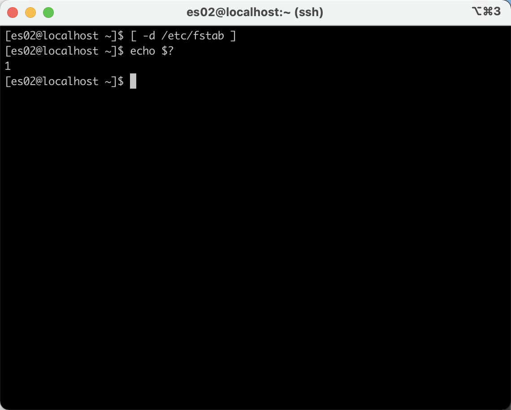
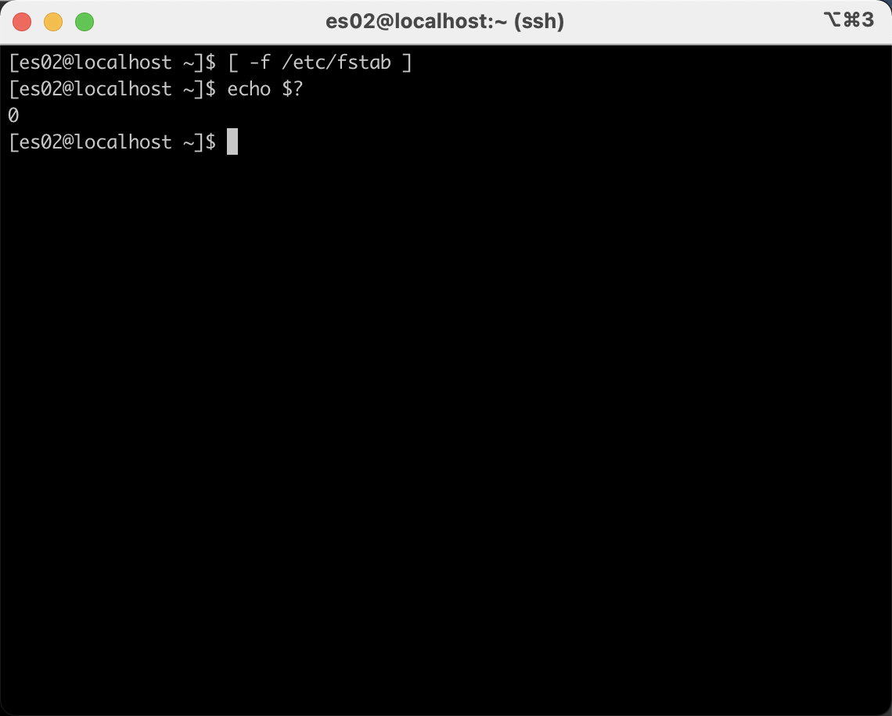
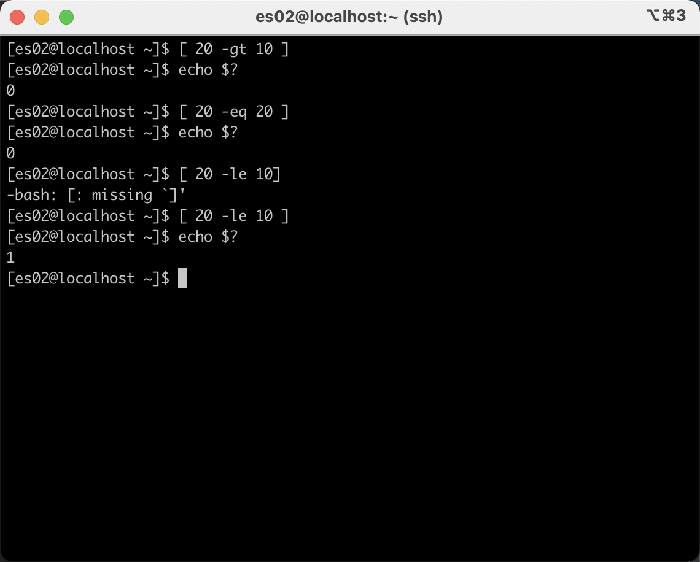
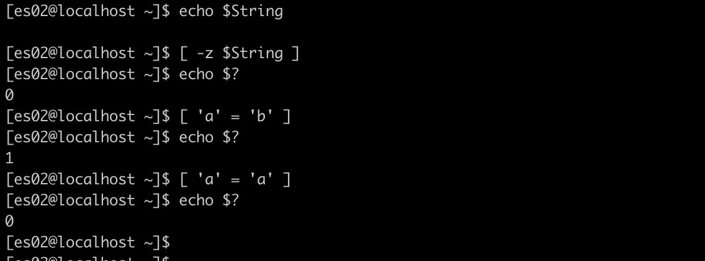

## shell 判断的条件

> 格式： `[ 条件表达式 ]`

### 文件测试语句

#### 文件测试的参数

|运算符|作用|
|----|----|
| -d | 测试文件是否为目录类型 |
| -e | 测试文件是否存在 |
| -f | 判断文件是否为一般文件 |
| -r | 测试当前用户是否有权限读取 |
| -w | 测试当前用户是否有权限写入 |
| -x | 测试当前用户是否有权限执行 |

#### 文件测试示例

- 例1：
  
  判断`/etc/fstab`是否为一个目录类型  

- 解：

  step1: `[ -d /etc/fstab ]`  

  step2: `echo $?` # 通过shell内设的`$?`来显示上一条命令执行后的返回值

- 释:

  控制台输出0，目录存在，返回非零的值，目录不存在。

- 图：

---

- 例2：
  
  判断`/etc/fstab`是否为一个文件类型

- 解：

  step1: `[ -f /etc/fstab ]`  
  step2: `echo $?`

- 释:

  1.控制台输出0，目录存在，返回非零的值，目录不存在。  
  2.用`-f`参数来判断是否是文件类型  
  3.文件是否存在、能否写入、执行、读取...同理，不再举例.

- 图：

### 逻辑测试语句

与(&&)  
表示前面的命令执行成功才会执行后面的命令  
如：[ -f /ect/fstab ] && echo 'Exists'  

或(||)  
表示前面的命令执行失败后才会在还行他后面的命令  
如：[ $USER = root ] || echo "user"  

非(!)
表示把测试条件中的结果取相反值
如: [! $USER = root ] || echo "admin"

例：看如下shell语句  

`[ ! $USER = root ] && echo "user" || echo "root"`  

理解：当前用户是root，取反，&& 不成立。不会输出user，当前用户不是root，取反，&&成立，输出user，有点`类似java的三元表达式`，bool ? true : false  

### 数值比较语句

#### 数值比较运算符

| 运算符 | 作用 |
| ---- | ---- |
| -eq | 是否等于 |
| -ne | 是否不等于 |
| -gt | 是否大于 |
| -lt | 是否小于 |
| -le | 是否等于或小于 |
| -ge | 是否大于或等于 |

例1：  

  判断20 是否大于10

解：  

  `[ 20 -gt 10 ]`

例2：  

  判断20 是否等于20

解：  

  `[ 20 -eq 20 ]`

图：  

总结： 数值比较没啥好总结的。

### 字符串比较语句

#### 字符串比较参数

| 运算符 | 作用 |
| ---- | ---- |
| = | 比较字符串内容是否相等 |
| != | 比较字符串内容是否不同 |
| -z | 判断字符串内容是否为空 |

图：  

总结：看字面意思就行