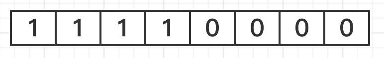
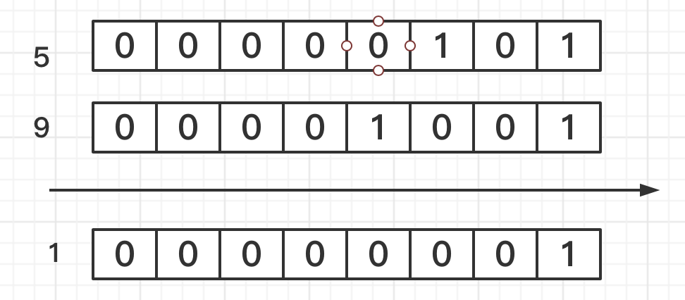
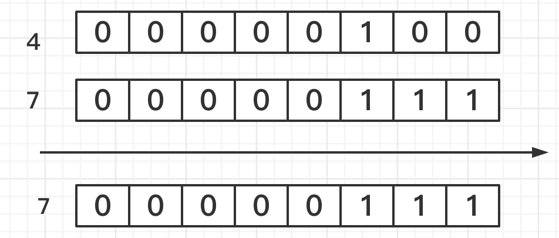
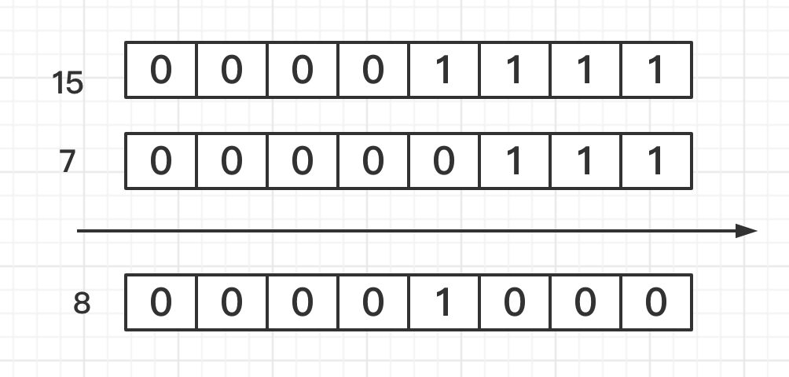

# 位运算

令人头疼的位运算😑。计算机只认0和1，也就是二进制，这我知道。编码中最小的单位是字节（byte），一个字节有八位，每一位都是0或1，这我也知道，所以一个字节用二进制表示就是这样。

## 与运算符（&）

计算：5 & 9  

先把5和9分别转换为二进制

5：0000 0101

9：0000 1001

计算方法：1=true，0=false没意见吧。那就开始说明计算方法，

同位之间

**全true(1)，为true(1)**

**全false(0)，为false(0)**

**一true(1)，一false(0)，为false(0)**

看图

## 或运算符（|）

计算：4 | 7

先把4和6分别转换为二进制

4: 0000 0100

7: 0000 0111

计算方法：

同位之间

**遇true(1)为true(1)**

**无true(1)为false(0)**

看图

## 异或运算符（^）

计算：7 ^ 15

7: 0000 0111

15: 0000 1111

计算方法

同位之间相同为false,

不同为true

## 取反运算符（~）

计算：~15

15：0000 0000 0000 0000 0000 0000 0000 1111

计算方法：把0变成1，1变成0

得到 -16：1111 1111 1111 1111 1111 1111 1111 0000

二进制中，最高位符号1表示负数，0表示正数

## 左移运算符（<<）

计算：12 << 2、8 << 4、9 << 8、14 << 16

计算方法：向左移动n位

12 << 2 = 48

8 << 4 = 128

9 << 8 = 576

14 << 16 = 917504

**快速的算法  M << n  其实可以这么算  M << n = M \* 2^n**

## 右移运算符（>>）

计算方法：往右移动n位，如 12 >> 2 = 3、32 >> 4 = 2

**快速的算法  M >> n  其实可以这么算  M >> n = M / 2^n**

## 无符号右移（>>>）

高位补0

