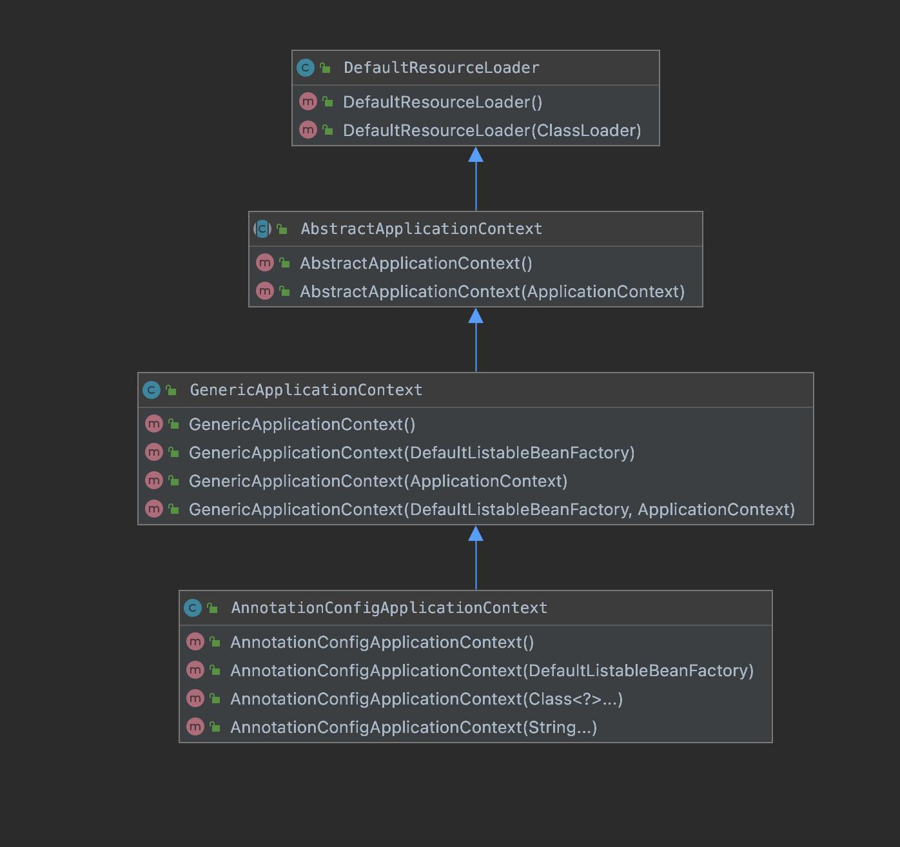
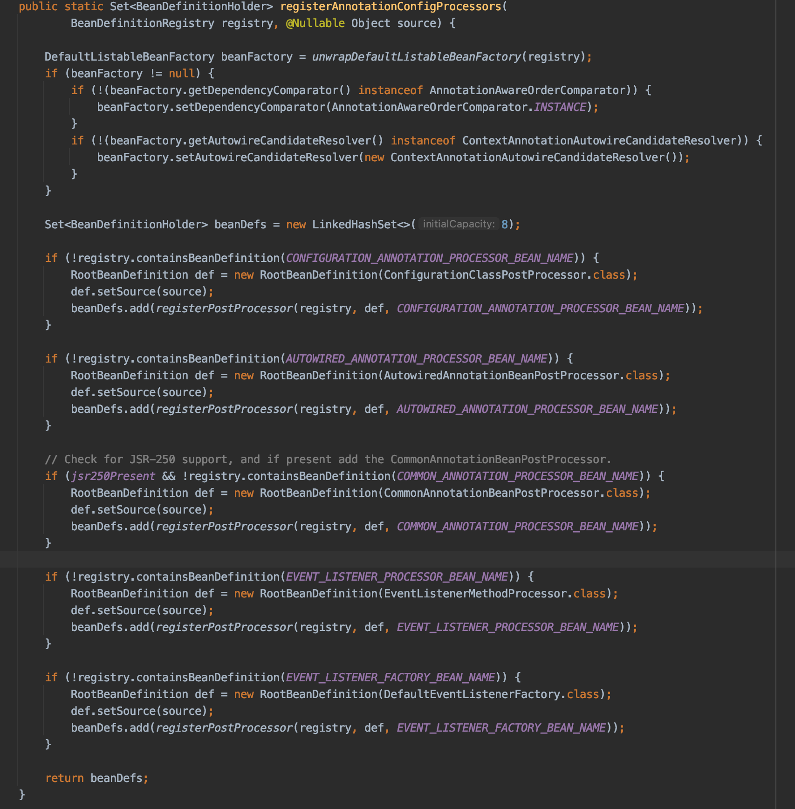
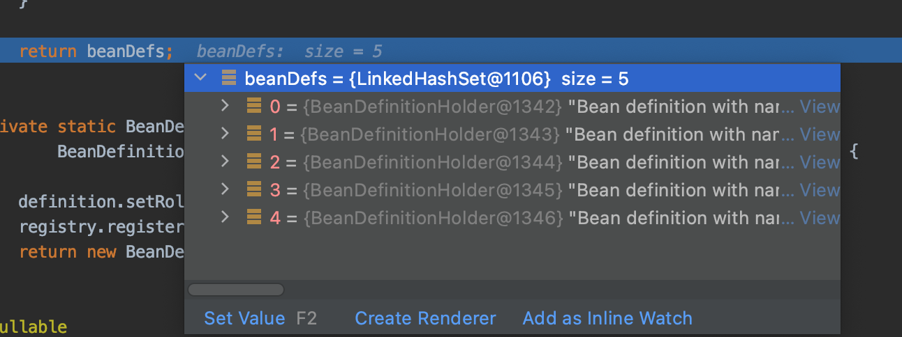

# Spring注解版启动流程


话不多说，先上代码。

```java
public class Test01 {
	public static void main(String[] args) {
		// 创建容器
		AnnotationConfigApplicationContext ac = new AnnotationConfigApplicationContext(AppConfig.class);
		// 从容器中获取Bean
		UserServiceImpl bean = ac.getBean(UserServiceImpl.class);
		System.out.println(bean);
	}
}
```

其实我们都知道，如果是注解版的，对应`ApplicationContext`就是`AnnotationConfigApplicationContext`，如果是xml版的，对应的`ac`就是`ClassPathXmlApplicationContext`。这里不用解释太多。点进去，可以看到。

```java
public AnnotationConfigApplicationContext(Class<?>... componentClasses) {
    this();
    register(componentClasses);
    refresh();
}
```

先是调用了自己的无参构造函数，然后调用了`register`方法，最后调用了`refresh`方法，代码一目了然，无需过多解释。


进入无参构造器。

```java
public AnnotationConfigApplicationContext() {
    this.reader = new AnnotatedBeanDefinitionReader(this);
    this.scanner = new ClassPathBeanDefinitionScanner(this);
}
```

虽然此处只有两行代码，但是别小看这两行代码。非常之重要，可以说，没有这两行代码Spring容器就启动不起来。

但是我想说的并不是这个，因为我们现在走到了无参构造器中。学过java的都知道，当实例化一个类的时候，需要看先实例化其父类。所以，我们看一下他的类结构图。 

   

再看下他的父类的无参构造方法都干了什么事情

```java
public GenericApplicationContext() {
    this.beanFactory = new DefaultListableBeanFactory();
}

public AbstractApplicationContext() {
    this.resourcePatternResolver = getResourcePatternResolver();
}

protected ResourcePatternResolver getResourcePatternResolver() {
    return new PathMatchingResourcePatternResolver(this);
}

public DefaultResourceLoader() {
    this.classLoader = ClassUtils.getDefaultClassLoader();
}
```

先不深究其作用，但我们现在最起码知道`AnnotationConfigApplicationContext`实例化的时候，‘顺便’实例化了哪些类。

然后再回到`AnnotationConfigApplicationContext`的默认构造方法。

他做的事情也很简单，只是实例化了两个类

1. AnnotatedBeanDefinitionReader reader 

   此处我想要说一句，看到这里，我们已经看了许多个Spring的类了，他们的名字都很长。这里我想读一下这个类的函义

   注解版的Bean定义读取器，我英文不好。但我认为，他就是读取BeanDefinition的。具体什么是BeanDefinition，后面在分析

   ```java
   public AnnotatedBeanDefinitionReader(BeanDefinitionRegistry registry, Environment environment) {
       Assert.notNull(registry, "BeanDefinitionRegistry must not be null");
       Assert.notNull(environment, "Environment must not be null");
       this.registry = registry;
       this.conditionEvaluator = new ConditionEvaluator(registry, environment, null);
       AnnotationConfigUtils.registerAnnotationConfigProcessors(this.registry);
   }
   ```

   经过1个构造函数，会走到这里。此处的`AnnotationConfigUtils.registerAnnotationConfigProcessors(this.registry);`是关键代码

   先说作用：他注册了Spring在启动过程中必须用到的一些类。

   然后我们来看看他都注册了哪些类。

   


这里我删除了几行代码，就是这个

```java

// Check for JPA support, and if present add the PersistenceAnnotationBeanPostProcessor.
if (jpaPresent && !registry.containsBeanDefinition(PERSISTENCE_ANNOTATION_PROCESSOR_BEAN_NAME)) {
    RootBeanDefinition def = new RootBeanDefinition();
    try {
        def.setBeanClass(ClassUtils.forName(PERSISTENCE_ANNOTATION_PROCESSOR_CLASS_NAME,
                                            AnnotationConfigUtils.class.getClassLoader()));
    }
    catch (ClassNotFoundException ex) {
        throw new IllegalStateException(
            "Cannot load optional framework class: " + PERSISTENCE_ANNOTATION_PROCESSOR_CLASS_NAME, ex);
    }
    def.setSource(source);
    beanDefs.add(registerPostProcessor(registry, def, PERSISTENCE_ANNOTATION_PROCESSOR_BEAN_NAME));
}
```

因为默认情况下它不会进这个if判断


总结一下:

1.ConfigurationClassPostProcessor

2.AutowiredAnnotationBeanPostProcessor

3.CommonAnnotationBeanPostProcessor

4.EventListenerMethodProcessor

5.DefaultEventListenerFactory



这五个类，可是说是Spring中开天辟地的五个类。而我接下来要讲的`@ComponentScan`注解的实现就在`ConfigurationClassPostProcessor`中

2.ClassPathBeanDefinitionScanner scanner

同上，类路径Bean定义扫描器。顾名思义，这个类就是扫描我们类路径下的的类的。但我可以明确的告诉你，真正扫描的类的并不是此处new出来的。后面我会展示代码说明。根据我的理解，这里new出来一个scanner只是给用户提供注册BeanDefinition的API。


